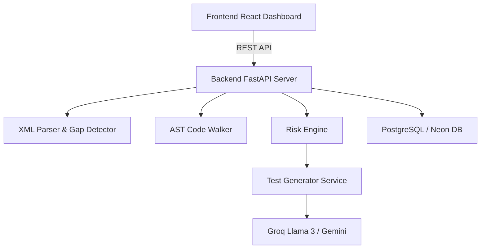

# CoverageIQ AI

CoverageIQ AI is a next-generation code coverage analysis and intelligent test generation platform. It moves beyond static percentage tracking by integrating AST-based static code analysis with Generative AI (Groq & Gemini) to identify untested code, quantify risk, and autonomously write test suites.

# Team Information

## Team Name
Gap Sentinels

## Team Members
- Sujith Kumar
- Hima Bindu
- Dhanusha

## Quick Links

Demo Video:
https://drive.google.com/file/d/1INa59mjqfxON3Spp-jbgTaSrZtVBVMRZ/view?usp=sharing

AI Usage Note:
./ai_usage_note.md

Prompt Documentation:
./prompts.md

Architecture:
./docs/ARCHITECTURE.md

Sample Data:
./sample_data

Test Cases:
./tests

Team Resumes:

- Sujith Kumar → ./resumes/Sujith_Kumar_Resume.pdf
- Hima Bindu → ./resumes/Hima_Bindu_Resume.pdf
- Dhanusha → ./resumes/Dhanusha_Resume.pdf


## Problem Statement
Traditional test coverage tools offer blind percentages (e.g., "75% covered") without providing context on **what** is uncovered or **why** it matters. Engineering teams lack visibility into whether critical business logic is missing tests, and they spend significant manual effort writing boilerplate tests to fill gaps.

CoverageIQ AI solves this by translating raw `coverage.xml` artifacts into actionable, function-level intelligence, and autonomously generating the missing test code.

## Features
- **Intelligent XML Parsing**: Securely parses Cobertura `coverage.xml` reports to extract module and class-level hit data.
- **AST Code Walking**: Statically analyzes the uploaded project source tree using Python's `ast` to discover all defined functions.
- **Coverage Gap Detection**: Reconciles AST functions against the XML report to pinpoint exactly which functions are covered, partially covered, or uncovered.
- **Risk Engine Analysis**: Assigns an automated Risk Score (CRITICAL, HIGH, MEDIUM, LOW) to uncovered functions based on cyclomatic complexity, dependency count, and code length.
- **Executive Dashboard**: Provides a unified view of the system's "Health Score", grading the project's testing resilience and highlighting the most vulnerable functions.
- **Generative AI Test Writing**: Utilizes LLMs to automatically write functional `pytest` unit tests for the most at-risk, uncovered functions.
- **Dependency & Traceability**: Identifies upstream dependencies to determine cascading risks.
- **Governance & Explainability Trail**: Maintains an immutable audit log of all system actions and provides transparent explanations for *why* an AI generated a specific test.

## AI Capability Demonstrated
CoverageIQ AI leverages Large Language Models (LLMs) to perform **Autonomous Code Generation & Intelligence Structuring**:
- **Test Generation**: The `TestGeneratorService` prompts LLMs with the precise abstract syntax tree and source code of an untested function to generate syntactically correct `pytest` tests.
- **Risk Scoring**: The system dynamically evaluates whether an LLM or static heuristic is best suited to determine risk thresholds.
- **Zero-Shot Understanding**: Operates across arbitrary Python codebases without prior training data.

## Architecture Overview
The system follows a modern decoupled architecture:
- **Frontend**: React + TypeScript + Vite. Provides a responsive, dynamic dashboard and file exploration interface.
- **Backend**: FastAPI + Python. Houses the core analysis engines (`Parser`, `AST Walker`, `Gap Detector`, `Risk Engine`, `Test Generator`).
- **Database**: PostgreSQL (via Neon Serverless) + SQLAlchemy async ORM. Stores parsed functions, generated tests, and audit trails.
- **AI Providers**: Groq (Llama 3) and Google Gemini via LangChain-compatible integrations.
- **Containerization**: Fully orchestrated via Docker Compose with strict healthcheck probing.



*For more details, see [docs/ARCHITECTURE.md](docs/ARCHITECTURE.md).*

## Live Deployment URLs
- **Frontend (Vercel)**: https://coverage-iq-ai.vercel.app
- **Backend (Render)**: https://coverageiq-ai.onrender.com

## Setup Instructions

### 1. Prerequisites
- Docker & Docker Compose
- Node.js 20+ (for local frontend development)
- Python 3.11+ (for local backend development)
- PostgreSQL Database URL (Neon or local)

### 2. Environment Variables

Required Environment Variables

Frontend:
* VITE_API_URL

Backend:
* DATABASE_URL
* SECRET_KEY
* GROQ_API_KEY
* GEMINI_API_KEY (optional)

## Run Instructions

### Running via Docker (Recommended)
```bash
docker-compose up -d --build
```
- Frontend will be available at: `http://localhost:5173`
- Backend API will be available at: `http://localhost:8000`

### Running Locally (Without Docker)
**Backend:**
```bash
cd backend
python -m venv venv
source venv/bin/activate  # On Windows: venv\Scripts\activate
pip install -r requirements.txt
alembic upgrade head
python -m uvicorn app.main:app --host 0.0.0.0 --port 8000 --reload
```

**Frontend:**
```bash
cd frontend
npm install
npm run dev
```

## API Documentation

FastAPI automatically generates an interactive OpenAPI (Swagger) dashboard for all backend routes. Once the backend is running, you can explore and test the endpoints directly at:
**[http://localhost:8000/docs](http://localhost:8000/docs)**

### Key Endpoints
- **`POST /api/reports/upload`**: Accepts a Cobertura XML or ZIP upload.
- **`POST /api/reports/{id}/analyze`**: Triggers AST tree parsing, gap detection, and risk scoring.
- **`GET /api/reports/{id}`**: Retrieves the full JSON metadata of a parsed report.

## Example Workflow (Reviewer Guide)

Follow these steps to experience the full intelligence loop:

1. **Start Backend**: Run `docker-compose up backend` or start natively via `uvicorn`.
2. **Start Frontend**: Run `npm run dev` in the frontend directory.
3. **Upload Report**: Navigate to `http://localhost:5173/upload`. Upload the provided sample file: `sample_data/banking_coverage.xml`.
4. **Map Source Directory**: When prompted for the source code path, enter the appropriate path:
   - If running via Docker Compose: `/workspace/sample_projects/banking`
   - If running natively: `<local-project-path>/sample_projects/banking`
5. **Run Analysis**: Click "Analyze". The system will dynamically build an AST, reconcile coverage gaps, and invoke Groq/Gemini to write missing tests.
6. **View Dashboard**: You will be redirected to the Executive Dashboard where you can view:
   - **Coverage Intelligence**: Overall system health score.
   - **Risk Analysis**: Specific lines of code graded by vulnerability.
   - **AI Test Generation**: Actionable, generated `pytest` snippets for the riskiest gaps.
   - **Coverage Improvement Prediction**: Calculated percentage bump if AI tests are applied.

## Sample Output
Upon successful analysis, the dashboard will render:
- **Coverage %**: 51.4%
- **Functions Found**: 7
- **Gaps Detected**: 2 Uncovered, 2 Partially Covered
- **Risk Assessment**: 2 Medium Risk, 5 Low Risk
- **AI Generated Tests**: The system will automatically present `pytest` assertions for the uncovered `transfer_funds` and `process_loan` functions.

## Test Generation Example
**Input (Untested Code):**
```python
def process_loan(amount, score):
    if score < 600: return False
    if amount > 100000 and score < 700: return False
    return True
```

**Output (Generated Test):**
```python
import pytest
from banking import process_loan

def test_process_loan_low_score():
    assert process_loan(50000, 550) == False

def test_process_loan_high_amount_mid_score():
    assert process_loan(150000, 650) == False

def test_process_loan_approved():
    assert process_loan(50000, 750) == True
```

## Governance Features
- **Immutable Audit Trail**: Every upload, scan, and generation event is recorded in the `AuditLog` table.
- **Explainability**: AI decisions are transparent. The system explicitly provides a "Why Selected?" rationale for every generated test, detailing the risk heuristics that triggered the LLM.

## Assumptions
- Target codebases are written in Python.
- Coverage reports are provided in standard `Cobertura XML` format.
- The backend has local read access to the target codebase's directory structure for AST traversal.

## Limitations
- Cross-language AST parsing (e.g., JavaScript/TypeScript) is not yet supported.
- LLM-generated tests require manual human review; the system does not automatically execute the tests it writes to verify them against the application state.

## Future Enhancements
- Integration with GitHub Actions / CI/CD pipelines to automatically comment generated tests on Pull Requests.
- Support for JavaScript/TypeScript (LCOV) formats.
- Automated sandbox execution to auto-verify generated tests.

## AI Usage Note
This project heavily utilizes AI assistance (via Google Gemini) for rapid prototyping, architecture planning, and feature implementation. See [./ai_usage_note.md](./ai_usage_note.md) for full disclosure of AI tooling used during development.

