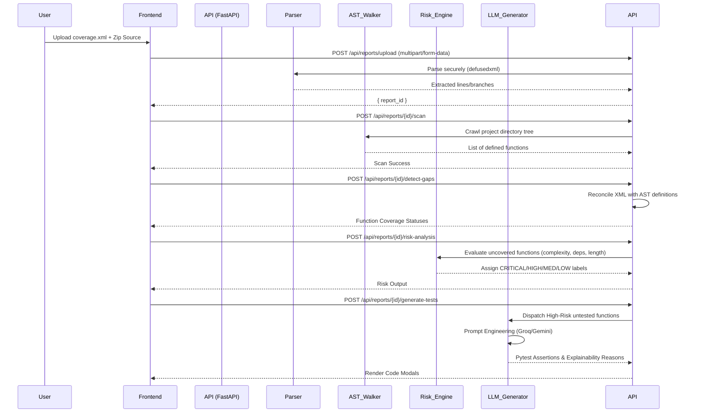

# CoverageIQ Pipeline Workflow

This document traces the exact data flow through the CoverageIQ system from the moment a user uploads a project to the moment AI-generated tests are rendered on the screen.

